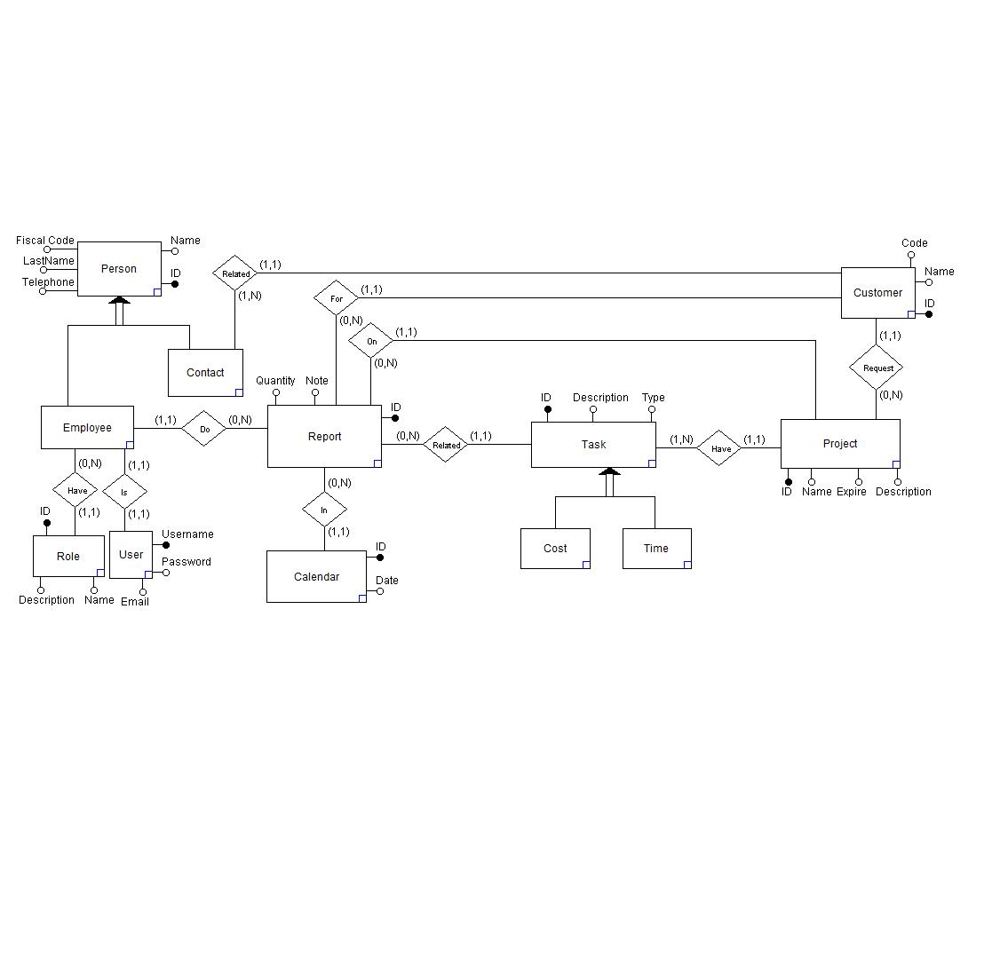

# Index #

1. Technology  
    1.1 Languages  
    1.2 Framework and Libraries  
    1.2 Tools
2. Data  
    2.1 Management  
    2.2 ER Diagram
    2.3 Dump  
---
# 1 Technology #  
## 1.1 Languages ##  
- Java  
- HQL  
- XML  
- CSS  
## 1.2 Framework and Libraries ##  
For the list of library and framework dependencies, look at the `pom.xml` file, managed by Maven.
## 1.3 Tools ##  
- Docker  
- Postgres  
- Maven
---
# 2 Data #
## 2.1 Management ##  
For the creation of the database was used Hibernate, 
a distributed framework that provides ORM services, 
that allow the management of data persistence on a relational database, Postgres in this case.   
## 2.2 ER Diagram ##  
  

---
# 3 Maven #
## 3.1 JUnit Jupiter ##
  
**JUnit** is used for unit tests, very convenient for the @BeforeAll and @AfterAll functions in order to prepare and clean the database before and after the relative tests.
## 3.2 Hibernate ##
  
**Hibernate** is a distributed framework that provides ORM services that allow the management of the persistence of data on the database itself through the representation and maintenance of a Java object system (called Entity) on a relational database.
## 3.3 PostgreSQL ##
  
**PostgreSQL** in this case is only the driver that interfaces the physical database to java, and is used only by **Hibernate**.
## 3.4 json-simple ##
**json-simple** is a library that is used for parsing classes in json and vice versa for sending data from server to client and vice versa.