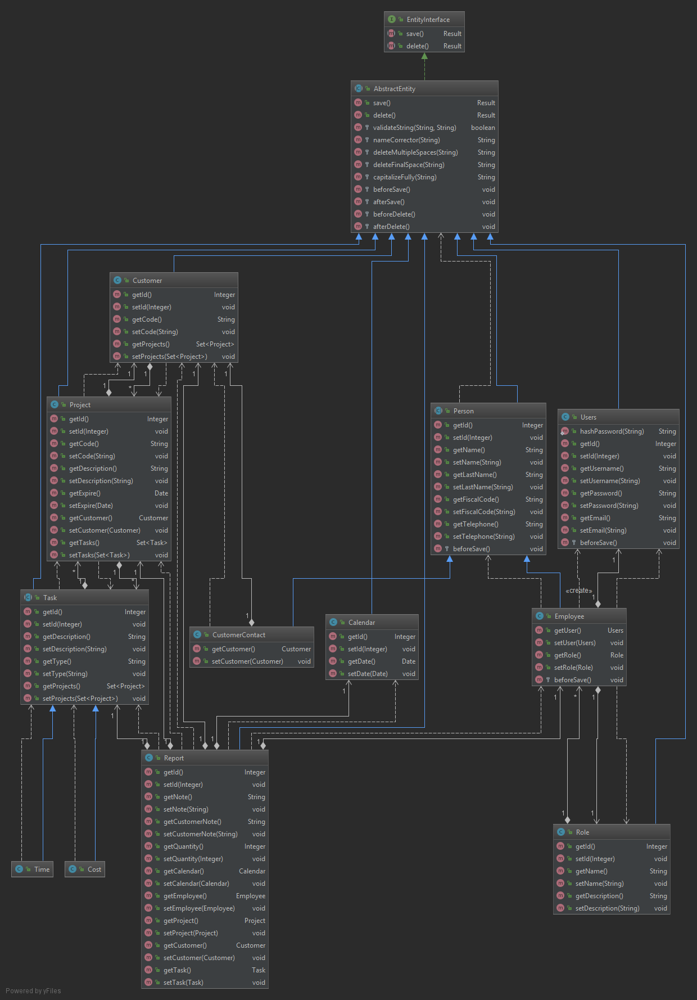

# Index #
1. [Technology](#Technology)  
    1.1 [Languages](#Languages)  
    1.2 [Framework and Libraries](#Framework and Libraries)  
    1.3 [Tools](#Tools)
2. [Data](#Data)  
    2.1 [Management](#Management)  
    2.2 [ER Diagram](#ER Diagram)  
3. [Maven](#Maven)  
    3.1 [JUnit Jupiter](#JUnit Jupiter)  
    3.2 [Hibernate](#Hibernate)  
    3.3 [PostgreSQL](#PostgreSQL)  
    3.4 [json-simple](#json-simple)  
    3.5 [Jackson](#Jackson)
4. [Server](#Server)  
    4.1 [Result](#Result)  
    4.2 [SessionManager](#SessionManager)  
    4.3 [Entities](#Entities)  
        4.3.1 [Design Pattern](#Design Pattern)  
        4.3.2 [AbstractEntity](#AbstractEntity)  
        4.3.3 [Attributes](#Attributes)  
        4.3.4 [Relations](#Relations)  
        4.3.5 [Filters](#Filters)  
        4.3.6 [Inheritance](#Inheritance)  
    4.4 [Repository](#Repository)  
    4.5 [Remote](#Remote)  
    4.6 [Test](#Test)  
5. [Client](#Client)  
    5.1 [Managers](#Managers)  
        5.1.1 [ControllerManager](#ControllerManager)  
        5.1.2 [RemoteManager](#RemoteManager)  
        5.1.3 [ViewsManager](#ViewsManager)  
    5.2 [Views](#Views)  
    5.3 [Controllers](#Controllers)  
        5.3.1 [TableController](#TableController)  
        5.3.2 [CalendarController](#CalendarController)  
    5.4 [Models](#Models)  
        5.4.1 [RowModel](#RowModel)  
        5.4.2 [CalendarDay](#CalendarDay)  
6. [Usage](#Usage) ???  
---
# 1 Technology #
<a name="Technology"></a>  
## 1.1 Languages ##  
<a name="Languages"></a>  
- Java  
- HQL  
- XML  
- CSS  
## 1.2 Framework and Libraries ##  
<a name="Framework and Libraries"></a>  
For the list of library and framework dependencies, look at the `pom.xml` file, managed by Maven.
## 1.3 Tools ##  
<a name="Tools"></a>  
- Docker  
- Postgres  
- Maven
---
# 2 Data #
<a name="Data"></a>  
## 2.1 Management ##  
<a name="Management"></a>  
For the creation of the database was used Hibernate, a distributed framework that provides ORM services, 
that allow the management of data persistence on a relational database, Postgres in this case.   
## 2.2 ER Diagram ##  
<a name="ER Diagram"></a>  
  

---
# 3 Maven #
<a name="Maven"></a>  
## 3.1 JUnit Jupiter ##
<a name="JUnit Jupiter"></a>  
**JUnit** is used for unit tests, very convenient for the @BeforeAll and @AfterAll functions in order to prepare and clean the database before and after the relative tests.
## 3.2 Hibernate ##
<a name="Hibernate"></a>  
**Hibernate** is a distributed framework that provides ORM services that allow the management of the persistence of data on the database itself through the representation and maintenance of a Java object system (called Entity) on a relational database.
## 3.3 PostgreSQL ##
<a name="PostgreSQL"></a>  
**PostgreSQL** in this case is only the driver that interfaces the physical database to java, and is used only by **Hibernate**.
## 3.4 json-simple ##
<a name="json-simple"></a>  
**json-simple** is a library that is used for parsing classes in json and vice versa for sending data from server to client and vice versa.
## 3.5 Jackson ##
<a name="Jackson"></a>  
**Jackson-mapper** is a library that is used to transform a data in JSON format into a class.

---
# 4 Server #
<a name="Server"></a>  
## 4.1 Result ##
<a name="Result"></a>  
This class is used to communicate DB operations' results.
Contains the result (true or false), a list of messages linked to the result and a list of data used in operations if needed.
Is very useful for its function that transforms the data it contains into a readable JSON object.
## 4.2 SessionManager ##
<a name="SessionManager"></a>  
Singleton class, it is used to always have the hibernate session available to every entity for database operations.
## 4.3 Entity ##
<a name="Entity"></a>  
### 4.3.1 Design Pattern ###
<a name="Design Pattern"></a>  

### 4.3.2 AbstractEntity ###
<a name="AbstractEntity"></a>  
The class implements the interface's save and delete methods. 
Entities have methods of creating, updating and deleting from CRUD methods.
This class also has the methods of before and after the save and delete operations for modeling the data if necessary.
### 4.3.3 Attributes ###
<a name="Attributes"></a>  
Each class that extends the AbstractEntity will have attributes that are correlated by Hibernate to the columns of the database table which the class is connected.
### 4.3.4 Relations ###
<a name="Relations"></a>  
They are attributes of type entity, so as to simulate the relation in the database also between the classes.
You can also specify cascadeType to perform the elimination of relation.
- **OneToOne:** Hibernate creates a column and a foreign key related to the primary key of the attribute OneToOne.  

Example class Person:  
```java
    @OneToOne(fetch = FetchType.EAGER, cascade = CascadeType.REMOVE)
    @JoinColumn(name = "user_id")
    private Users user;
```
- **ManyToOne / OneToMany:** Hibernate creates a column and a foreign key related to the primary key of the attribute ManyToOne.  
It is very important to specify the class that will have the foreign key, it is not necessary that the related class also has the OneToMany attribute (but it is strongly recommended).  

Example class Project:  
```java
    @ManyToOne(fetch = FetchType.EAGER, cascade = CascadeType.DETACH)
    @JoinColumn(name = "customer")
    private Customer customer;
```
Example class Customer:  
```java
    @OneToMany(mappedBy = "customer", fetch = FetchType.EAGER, cascade = CascadeType.REMOVE)
    private Set<Project> projects = new HashSet<>();
```

- **ManyToMany:** Hibernate creates a table with the two columns which contains the IDs of the related classes.  

Example class Project: 
```java
    @ManyToMany(cascade = CascadeType.DETACH, fetch = FetchType.EAGER)
    @JoinTable(
            name = "have",
            joinColumns = {@JoinColumn(name = "project_id")},
            inverseJoinColumns = {@JoinColumn(name = "task_id")}
    )
    private Set<Task> tasks = new HashSet<>();  
```

Example class Task:  
```java
    @ManyToMany(mappedBy = "tasks", fetch = FetchType.EAGER, cascade = CascadeType.DETACH)
    private Set<Project> projects = new HashSet<>();
```
 
### 4.3.5 Filters ###
<a name="Filters"></a>  
The filters are written in the entities because they have the interface with the database, but the Read operations are implemented by the Repositories.  
Example class Person:
```java
@FilterDefs({
        @FilterDef(name = "id", parameters = @ParamDef(name = "id", type = "integer")),
        @FilterDef(name = "code", parameters = @ParamDef(name = "code", type = "string")),
        @FilterDef(name = "description", parameters = @ParamDef(name = "description", type = "string")),
        @FilterDef(name = "expireFrom", parameters = {@ParamDef(name = "expireFrom", type = "date")}),
        @FilterDef(name = "expireTo", parameters = {@ParamDef(name = "expireTo", type = "date")}),
        @FilterDef(name = "customer", parameters = {@ParamDef(name = "customer", type = "integer")}),
})
@Filters({
        @Filter(name = "id", condition = "id = :id"),
        @Filter(name = "code", condition = "code like '%' || :code || '%'"),
        @Filter(name = "description", condition = "description like '%' || :description || '%'"),
        @Filter(name = "expireFrom", condition = "expire >= :expireFrom"),
        @Filter(name = "expireTo", condition = "expire <= :expireTo"),
        @Filter(name = "customer", condition = "customer = :customer")
})
```
### 4.3.6 Inheritance ###
<a name="Inheritance"></a>  
Inheritance is an important feature of Generalization and Specialization. It allows lower-level entities to inherit the attributes of higher-level entities.  
For example, the attributes of a Person class such as name, fiscal code, and telephone can be inherited by lower-level entities such as Employee or CustomerContact.
Another example is in Task, which is differentiated by category Time or Cost.

---