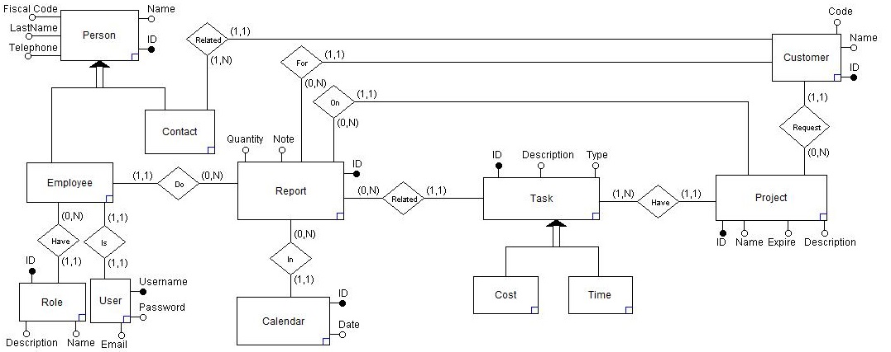

# Index #
- 1 [Description](#1-description)  
    - 1.1 [Goal](#11-goal)  
    - 1.2 [Demands](#12-demands)  
        - 1.2.1 [Employees](#121-employees)  
        - 1.2.2 [Projects](#122-projects)  
        - 1.2.3 [Customers](#123-customers)  
        - 1.2.4 [Reports](#124-reports)  
- 2 [Installation](#2-installation)  
- 3 [Technology](#3-technology)  
    - 3.1 [Languages](#31-languages)  
    - 3.2 [Framework and Libraries](#32-framework-and-libraries)  
    - 3.3 [Tools](#33-tools)
- 4 [Data](#4-data)  
    - 4.1 [Management](#41-management)  
    - 4.2 [ER Diagram](#42-er-diagram)  
    - 4.3 [Location](#43-location)  
    - 4.4 [Dump](#44-dump)  
- 5 [Maven](#5-maven)  
    - 5.1 [JUnit Jupiter](#51-junit-jupiter)  
    - 5.2 [Hibernate](#52-hibernate)  
    - 5.3 [PostgreSQL](#53-postgresql)  
    - 5.4 [json-simple](#54-json-simple)  
    - 5.5 [Jackson](#55-jackson)
- 6 [Server](#6-server)  
    - 6.1 [Result](#61-result)  
    - 6.2 [SessionManager](#62-sessionmanager)  
    - 6.3 [Entities](#63-entity)  
        - 6.3.1 [Class Diagram](#631-class-diagram)  
        - 6.3.2 [AbstractEntity](#632-abstractentity)  
        - 6.3.3 [Attributes](#633-attributes)  
        - 6.3.4 [Relations](#634-relations)  
        - 6.3.5 [Filters](#635-filters)  
        - 6.3.6 [Inheritance](#636-inheritance)  
    - 6.4 [Repository](#64-repository)  
        - 6.4.1 [Class Diagram](#641-class-diagram)  
        - 6.4.2 [AbstractRepository](#642-abstractrepository)  
        - 6.4.3 [Extensions](#643-extensions)  
    - 6.5 [Remote](#65-remote)  
        - 6.5.1 [Class Diagram](#651-class-diagram)  
        - 6.5.2 [BaseService](#652-baseservice)  
        - 6.5.3 [RelationService](#653-relationservice)  
        - 6.5.4 [UserService](#654-userservice)  
    - 6.6 [RemoteManager](#66-remotemanager)
- 7 [Client](#7-client)  
    - 7.1 [Views](#71-views)  
    - 7.2 [Controllers](#72-controllers)  
        - 7.2.1 [Class Diagram](#721-class-diagram)  
        - 7.2.2 [TableController](#722-tablecontroller)  
    - 7.3 [Models](#73-models)  
        - 7.3.1 [RowModel](#731-rowmodel)  
    - 7.4 [Managers](#74-managers)  
        - 7.4.1 [ControllerManager](#741-controllermanager)  
        - 7.4.2 [RemoteManager](#742-remotemanager)  
        - 7.4.3 [ViewsManager](#743-viewsmanager)  

---
# 1 Description #  
## 1.1 Goal ##  
Reporting management system to make it easy the overview in the company project's and the employees related.  
## 1.2 Demands ##  
### 1.2.1 Employees ###  
Management personal data of **employees**, be sure to save the **name**, **surname** and **fiscal code**.  
### 1.2.2 Projects ###  
Management of **projects** with **code** and **expiry date**, including the related **types of tasks** and **customers** that compose them
### 1.2.3 Customers ###  
Management of **customers** with **code** of the company.
### 1.2.4 Reports ###  
Every **employee** must have the possibility to insert his work **report** with the hours or cost, **project**, **customer** and **task** he has performed.

---
## 2 Installation ##
Follow the steps:
1) Download or Clone the source code (https://github.com/DeLillo96/Report).
2) On the machine that will host the database install one of the programs listed below  
    - Docker (https://www.docker.com/products) then run `up.sh` or run the command `docker-compose -p <container name> up -d` to start the database service
    - Postgres (https://www.postgresql.org/download/) then:
        1) Run the command `$sudo -u postgres psql` or just run the Postgres shell
        2) Run the following commands:  
            ```sql
            CREATE DATABASE application;  
            CREATE USER admin WITH ENCRYPTED PASSWORD 'admin';  
            GRANT ALL PRIVILEGES ON DATABASE application TO admin;
            ```
            > Obviously the name of database "**application**", the user "**admin**" and the password "**admin**" can be changed.  
            If you change them remember it, because Hibernate needs that information to work.
3) Install Java SE (https://www.oracle.com/technetwork/java/javase/downloads) on the Client and Server machine, version 8 is required.
4) On the Server run `Server.java`
    >if any of the database default data has been changed, remember to edit them in the `hibernate.cfg.xml` file.
5) On the Clients run `Client.java`

---
# 3 Technology #
## 3.1 Languages ##  
- Java  
- HQL  
- XML  
- CSS  
## 3.2 Framework and Libraries ##  
For the list of library and framework dependencies, look at the `pom.xml` file, managed by Maven.
## 3.3 Tools ##  
- Docker  
- Postgres  
- Maven

---
# 4 Data #
## 4.1 Management ##  
For the creation of the database was used Hibernate, a distributed framework that provides ORM services, 
that allow the management of data persistence on a relational database, Postgres in this case.   
## 4.2 ER Diagram ##  
  
## 4.3 Location ##  
If you use docker the database is located in a container that is turned on using the `up.sh` command and turns off using the `down.sh` command.  
## 4.4 DUMP ##  
To recover the database from a dump file is possible use `restore_db.sh` command, make sure the docker container is up.

---
# 5 Maven #
## 5.1 JUnit Jupiter ##
**JUnit** is used for unit tests, very convenient for the @BeforeAll and @AfterAll functions in order to prepare and clean the database before and after the relative tests.
## 5.2 Hibernate ##
**Hibernate** is a distributed framework that provides ORM services that allow the management of the persistence of data on the database itself through the representation and maintenance of a Java object system (called Entity) on a relational database.
## 5.3 PostgreSQL ##
**PostgreSQL** in this case is only the driver that interfaces the physical database to java, and is used only by **Hibernate**.
## 5.4 json-simple ##
**json-simple** is a library that is used for parsing classes in json and vice versa for sending data from server to client and vice versa.
## 5.5 Jackson ##
**Jackson-mapper** is a library that is used to transform a data in JSON format into a class.

---
# 6 Server #
## 6.1 Result ##
This class is used to communicate DB operations' results.
Contains the result (true or false), a list of messages linked to the result and a list of data used in operations if needed.
Is very useful for its function that transforms the data it contains into a readable JSON object.
## 6.2 SessionManager ##
Singleton class, it is used to always have the hibernate session available to every entity for database operations.
## 6.3 Entity ##
### 6.3.1 Class Diagram ###
  
### 6.3.2 AbstractEntity ###
The class implements the interface's save and delete methods. 
Entities have methods of creating, updating and deleting from CRUD methods.
This class also has the methods of before and after the save and delete operations for modeling the data if necessary.
### 6.3.3 Attributes ###
Each class that extends the AbstractEntity will have attributes that are correlated by Hibernate to the columns of the database table which the class is connected.
### 6.3.4 Relations ###
They are attributes of type entity, so as to simulate the relation in the database also between the classes.
You can also specify cascadeType to perform the elimination of relation.
- **OneToOne:** Hibernate creates a column and a foreign key related to the primary key of the attribute OneToOne.  

Example class Person:  
```java
    @OneToOne(fetch = FetchType.EAGER, cascade = CascadeType.REMOVE)
    @JoinColumn(name = "user_id")
    private Users user;
```
- **ManyToOne / OneToMany:** Hibernate creates a column and a foreign key related to the primary key of the attribute ManyToOne.  
It is very important to specify the class that will have the foreign key, it is not necessary that the related class also has the OneToMany attribute (but it is strongly recommended).  

Example class Project:  
```java
    @ManyToOne(fetch = FetchType.EAGER, cascade = CascadeType.DETACH)
    @JoinColumn(name = "customer")
    private Customer customer;
```
Example class Customer:  
```java
    @OneToMany(mappedBy = "customer", fetch = FetchType.EAGER, cascade = CascadeType.REMOVE)
    private Set<Project> projects = new HashSet<>();
```

- **ManyToMany:** Hibernate creates a table with the two columns which contains the IDs of the related classes.  

Example class Project: 
```java
    @ManyToMany(cascade = CascadeType.DETACH, fetch = FetchType.EAGER)
    @JoinTable(
            name = "have",
            joinColumns = {@JoinColumn(name = "project_id")},
            inverseJoinColumns = {@JoinColumn(name = "task_id")}
    )
    private Set<Task> tasks = new HashSet<>();  
```

Example class Task:  
```java
    @ManyToMany(mappedBy = "tasks", fetch = FetchType.EAGER, cascade = CascadeType.DETACH)
    private Set<Project> projects = new HashSet<>();
```
 
### 6.3.5 Filters ###
The filters are written in the entities because they have the interface with the database, but the Read operations are implemented by the Repositories.  
Example class Person:
```java
@FilterDefs({
        @FilterDef(name = "id", parameters = @ParamDef(name = "id", type = "integer")),
        @FilterDef(name = "code", parameters = @ParamDef(name = "code", type = "string")),
        @FilterDef(name = "description", parameters = @ParamDef(name = "description", type = "string")),
        @FilterDef(name = "expireFrom", parameters = {@ParamDef(name = "expireFrom", type = "date")}),
        @FilterDef(name = "expireTo", parameters = {@ParamDef(name = "expireTo", type = "date")}),
        @FilterDef(name = "customer", parameters = {@ParamDef(name = "customer", type = "integer")}),
})
@Filters({
        @Filter(name = "id", condition = "id = :id"),
        @Filter(name = "code", condition = "code like '%' || :code || '%'"),
        @Filter(name = "description", condition = "description like '%' || :description || '%'"),
        @Filter(name = "expireFrom", condition = "expire >= :expireFrom"),
        @Filter(name = "expireTo", condition = "expire <= :expireTo"),
        @Filter(name = "customer", condition = "customer = :customer")
})
```
### 6.3.6 Inheritance ###
Inheritance is an important feature of Generalization and Specialization. It allows lower-level entities to inherit the attributes of higher-level entities.  
For example, the attributes of a Person class such as name, fiscal code, and telephone can be inherited by lower-level entities such as Employee or CustomerContact.
Another example is in Task, which is differentiated by category Time or Cost.

## 6.4 Repository ##
### 6.4.1 Class Diagram ###
  
### 6.4.2 AbstractRepository ###
The class implements the interface's read methods. 
Repositories have methods of reading and searching from CRUD methods.
There is the possibility with this class to use a custom query instead of the query fixed only to the table of interest (query language is not SQL but HQL).
### 6.4.3 Extensions ###
Each class that extends the abstract class must have the name of the table related, it is also possible to write some researches if necessary.  
Example class UsersRepository:  
```java
public Users getUserByUsername(String username) {
    HashMap<String, Object> params = new HashMap<>();
    params.put("username", username);
    List users = read(params);

    return users != null && users.size() == 1 ? (Users) users.get(0) : null;
}
```

## 6.5 Remote ##
### 6.5.1 Class Diagram ###
  
### 6.5.2 BaseService ###
The BaseService is a class for communication between client and server, it receives data in json format and involves the repository, or the related entity for the various CRUD operations requested by the client.  
### 6.5.3 RelationService ###
The RelationService has the same principle as the BaseService but works only on readings, assignments and assignments of relation, not only on single tables.  
### 6.5.4 UserService ###
It is an extension of the base service, it is a special case because it implements the login and logout methods.  

## 6.6 RemoteManager ##
The RemoteManager is a class that initializes the implementations of the different services mentioned [above](#65-remote) and creates the bind between these objects and the RMI services.  
This operation is done at the beginning of the server execution.  

---
# 7 Client #
For the part of the GUI the Model View Controller Design Pattern was chosen.  
Each controller will have access to the service made available by the server through the RMI protocol.  
The Client has no logical part except the management of the GUI, everything is done inside the Server and the result is notified in the GUI itself.

## 7.1 Views ##
The views were built with the FXML format, in each view the controller is defined, which will manage events and objects GUI.  
A default style has been applied to all views of the project, defined in the `default.css` file.  

## 7.2 Controllers ##
### 7.2.1 Class Diagram ###
  
### 7.2.2 TableController ###
The tableController is a particular controller, a table is managed with its own filters and populated through the specified service.  
Each implementation of the AbstractTableController must define the filters and the RowModel which manages the table row.  

## 7.3 Models ##
All the models in the project are of the RowModel type except for CalendarDay which manages the calendar cell.  
### 7.3.1 RowModel ###
The RowModel object is strictly related to its table, the raw data live within this model, so the Save and Delete methods are implemented by the RowModel and not in the TableController.  

## 7.4 Managers ##
### 7.4.1 ControllerManager ###
It is a Singleton class used to have the IDs of the employee who has accessed the platform.  
### 7.4.2 RemoteManager ###
It is a Singleton class used to connect to the RMI services provided by the Server.  
### 7.4.3 ViewsManager ###
Is a singleton class used to manege, render Views, Popups and Notifications.  

---